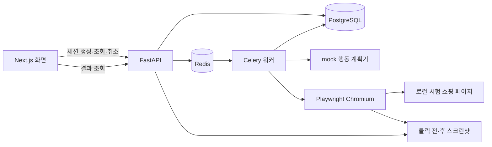

# 연결 구조와 확장 위치

## 한 번의 실행 흐름



API/워커/화면은 개발 PC에서 실행하고, PostgreSQL과 Redis만 Compose 컨테이너로 실행합니다. 워커는 요청과 분리되어 실행 1건을 처리하고 실행 상태/단계 기록을 DB에 남깁니다. 스크린샷은 프로젝트 `artifacts` 디렉터리에 저장합니다.

## 초기 API 계약

| 요청 | 결과 |
|---|---|
| `GET /health` | API 상태 확인 |
| `POST /sessions` | 실행 생성, `202`와 세션 상세 반환 |
| `GET /sessions` | 최신 실행부터 요약 목록 반환 |
| `GET /sessions/{id}` | 실행 상태, 단계, 오류, 스크린샷 주소 반환 |
| `POST /sessions/{id}/cancel` | 취소 요청 |
| `GET /artifacts/{id}/{filename}` | 실행 스크린샷 조회 |
| `GET /fixtures/shop` | 외부 접근이 필요 없는 시험 페이지 |

현재 생성 요청은 다음과 같습니다. `task_id`는 데모 과업 `T02`만 사용합니다. `Idempotency-Key` 헤더를 지정하면 같은 키의 반복 요청으로 실행이 중복 생성되는 것을 막습니다.

```json
{
  "persona_name": "초보 러너",
  "task_id": "T02"
}
```

실행 상태는 `queued`, `running`, `succeeded`, `technical_error`, `cancelled`입니다. 요약에는 `created_at`, `started_at`, `finished_at`, `steps_count`가 있습니다. 상세의 단계에는 `action`, `url`, `description`, `status`, `screenshot_before`, `screenshot_after`가 있으며, 화면 주소는 API 기준 상대 경로입니다. 정확한 응답 필드는 실행 중인 `/docs`에서 확인합니다.

취소는 협력 방식으로 처리합니다. 이미 시작한 브라우저 작업을 즉시 강제 종료하는 보장은 없으며 워커가 실행 상태를 확인해 후속 작업을 중단합니다.

## 담당자가 확장할 곳

- `apps/web`: 세션 화면, 조회 주기, 스크린샷 검토 UI.
- `backend/src/persona/api.py`, `schemas.py`: API 입출력과 검증.
- `models.py`, `db.py`, `migrations`: 저장 구조와 DB 변경.
- `worker.py`: 큐 작업, 실행 상태, 취소/실패 처리.
- `planner.py`: 과업을 행동으로 바꾸는 계획기. 현재 고정 행동을 반환하며 실제 모델 연결은 여기의 계약을 유지하는 어댑터로 추가.
- `browser.py`, `execution.py`: 허용된 페이지 조작, 단계 기록, 스크린샷 저장. 새 행동을 추가할 때 입력 검증과 실패 기록도 함께 확장.

현재는 지정된 로컬 시험 페이지로 범위를 제한합니다. 외부 사이트 URL, 임의 셀렉터, 실제 구매 기능을 받는 API는 제공하지 않습니다. 실제 연구에서는 페르소나 데이터, 계획의 타당성, 과업 판정, 비교 지표를 별도로 설계하고 검증해야 합니다.

## 검증 범위

`check.sh`는 백엔드 코드/단위 테스트와 프런트 검사/빌드를 수행합니다. CI는 여기에 실제 Chromium으로 로컬 시험 페이지를 조작하는 브라우저 테스트를 추가합니다. `scripts/smoke.py`는 개발 환경에서 API → DB → Redis → 워커 → 브라우저 → 결과/화면 조회까지 확인합니다. 이 연결 확인은 연구 성능이나 페르소나 재현성을 증명하지 않습니다.
