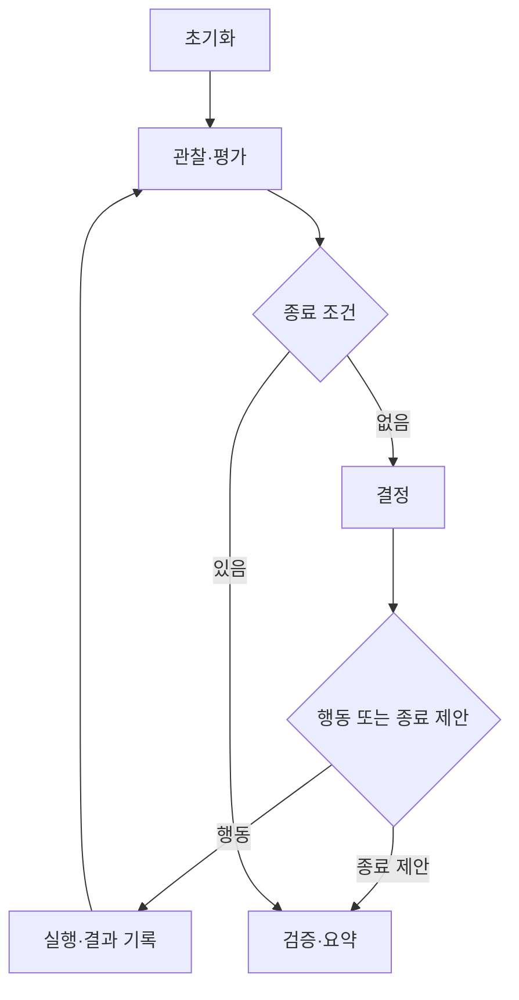

# Task 05 — 실행 루프, 종료, 기록

상태: 구현 완료; live run 검증 대기 | 선행: 04 | 단계: MVP

## 목표

관찰 → 결정 → 실행 → 재관찰을 반복해 한 번의 세션을 끝내고, 어떤 일이 일어났는지 다시 확인할 수 있게 한다.

설계 연결: 논문 §3.2.3. 상태 머신·평가 코드·파일 계약은 이 프로젝트의 설계다.

## 상태 흐름



## 구현 체크리스트

- [ ] 실행마다 새로운 browser context를 만들고 persona/config의 스냅샷을 저장한다.
- [ ] 처음부터 evaluator를 실행해 시작 상태가 이미 성공인지 확인한다.
- [ ] 각 결정은 최신 Observation을 사용한다.
- [ ] 실행 뒤 안정화 → 새 관찰 → evaluator 순서를 유지한다.
- [ ] action attempt, 실제 실행 성공, 모델 요청 수를 별도로 센다.
- [ ] 예상한 오류는 다음 관찰에 전달하고 치명적인 오류는 중단한다.
- [ ] 종료 또는 예외 발생 시 열린 파일·브라우저·진행 중 API 작업을 정리한다.
- [ ] Ctrl+C에서도 지금까지의 로그와 `interrupted` 요약을 남긴다.

## 종료 사유와 검증 결과 분리

`termination_reason`은 실행이 끝난 이유다.

- `verified_success`: evaluator가 성공 확인.
- `agent_finished`: 에이전트가 완료 주장했지만 성공이 확인되지 않음.
- `agent_gave_up`: 에이전트가 포기 제안.
- `max_steps`, `run_timeout`, `budget_exceeded`: 자원 상한.
- `stuck`: 같은 상태·행동 조합이 3회 반복.
- `model_error`, `browser_error`, `interrupted`: 실행 문제.

`verification`은 `success`, `failure`, `unknown` 중 하나다. 검사기가 없거나 검사 실패면 unknown이다. 거짓 완료는 failure로 남긴다. 시간 초과가 실제 UX 실패인지 자동으로 단정하지 않는다.

반복 감지는 URL 하나로 하지 않는다. 활성 탭, 의미 있는 DOM/입력값의 fingerprint, action type과 인자를 함께 사용하고 timestamp 등 변화하는 메타데이터는 제외한다.

## 기록 구조

```text
runs/<run_id>/
  config.json
  persona.json
  run.json
  steps.jsonl
  llm_calls.jsonl
  observations/obs-0001.json
  observations/obs-0001.png
  observations/obs-0002.json
  observations/obs-0002.png
  summary.json
```

`run_id`는 충돌하지 않게 생성한다. 실행 도중 JSONL을 append·flush하고, summary는 임시 파일 작성 후 교체한다. 중단된 실행도 과거 관찰을 지우지 않는다.

## StepRecord 예시

```json
{
  "step_id": 1,
  "observation_id": "obs-0001",
  "decision_id": "d-0001",
  "action_id": "a-0001",
  "next_observation_id": "obs-0002",
  "decision": {"plan": "상품을 검색한다", "rationale_summary": "검색창을 이용한다"},
  "action": {"type": "type", "target_id": "search.query", "text": "가방"},
  "result": {"ok": true, "error": null},
  "verification": "failure",
  "timing_ms": {"llm": 800, "action": 120, "settle": 200, "observation": 50}
}
```

예시는 주요 필드만 보여준다. 실제 저장에는 03의 완전한 Action과 ActionResult를 넣는다. 종료 제안에는 action/action_id가 null이며 마지막 관찰은 그대로 연결한다.

## 지표 계약

| 지표 | 정의 |
|---|---|
| steps | 판단 반복 횟수; 종료 제안 포함 |
| action_attempts | executor에 전달한 행동 수 |
| action_successes | executor ok=true 수; 과제 성공과 다름 |
| llm_request_count | 모든 모듈·재시도를 포함한 요청 수 |
| elapsed_ms | 시작부터 종료까지 monotonic 시간 |
| llm_ms | 응답 대기 누적; 병렬 실행 시 wall time과 다를 수 있음 |
| back_count | back 행동 실행 성공 수 |
| error_counts | 오류 코드별 발생 수 |

LLM 대기와 브라우저 대기를 사람의 망설임으로 해석하지 않는다. “UX 병목”의 근거는 시간 하나가 아니라 반복 행동·실패·해당 화면을 함께 사용한다.

## 완료 기준

1. mock provider로 성공·거짓 완료·무한 반복·오류·예산 종료 경로를 확인한다.
2. live provider로 1회 실행하고 실제 로그를 열어 관찰/행동 대응을 확인한다.
3. 시작 화면부터 종료 화면까지 누락 없이 연결되고 금액 미설정 시 cost=null이다.
4. evaluator가 실패한 실행을 성공으로 표시하지 않는다.

목표 CLI: `python -m uxagent run --study configs/study.json --provider mock` 또는 `--provider live`.

산출물: runner, 로그 writer, summary, 단일 실행 CLI. 여기까지 완료하면 첫 MVP가 완성된다.
